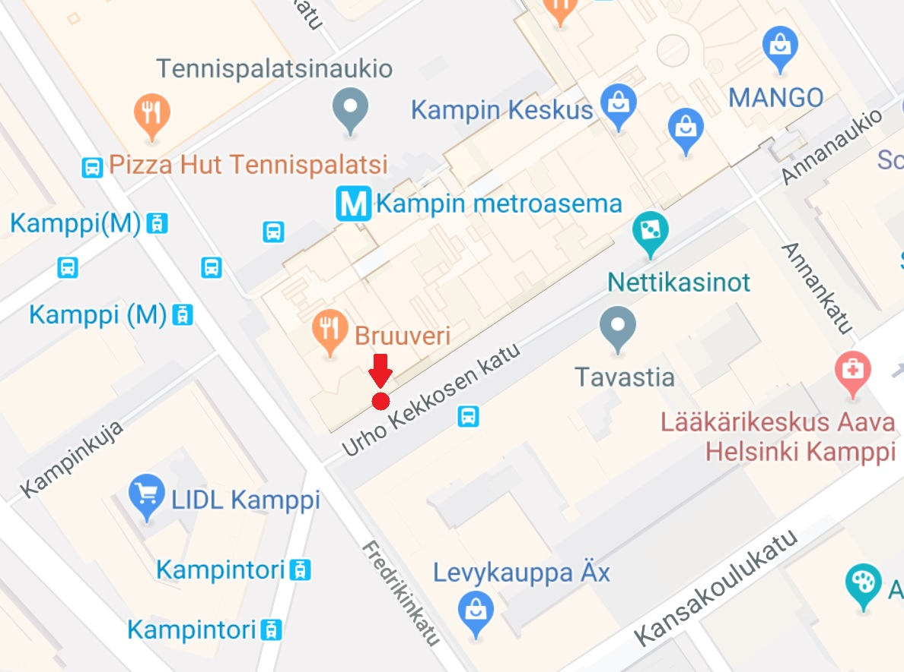
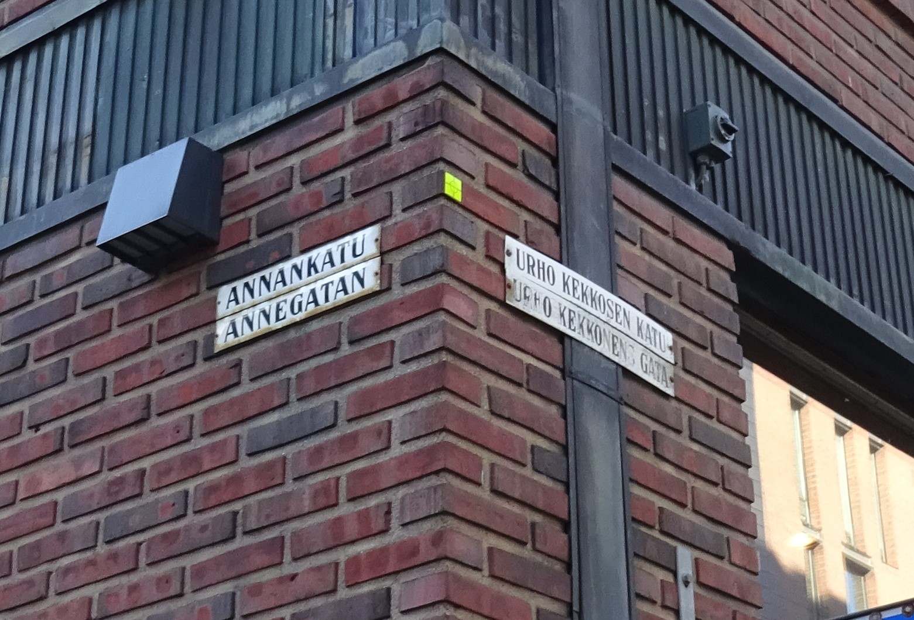
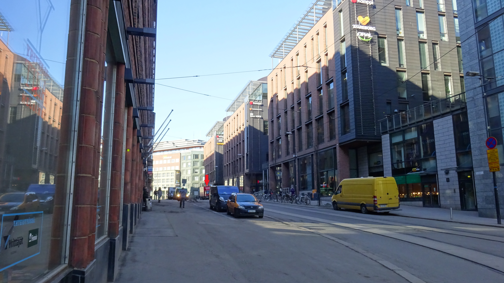
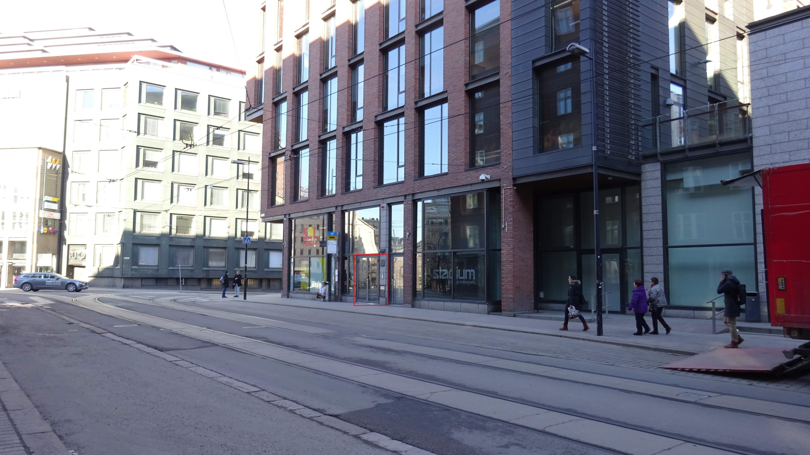
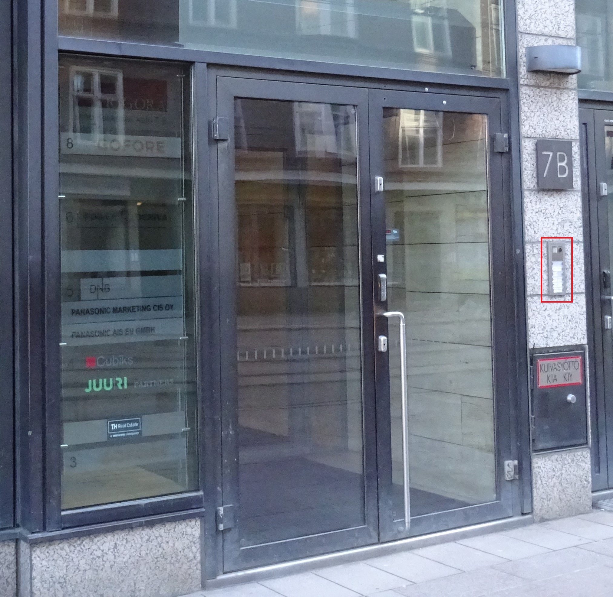
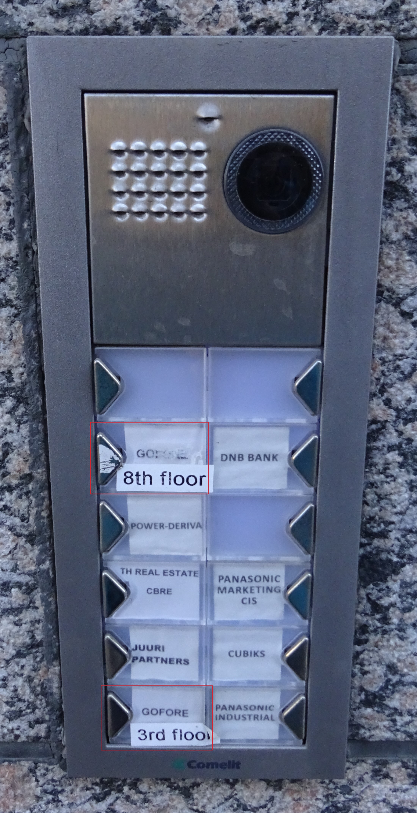

# Directions to the Gofore office in Kamppi 
Getting to the office can be a daunting task for any first time visitor. Luckily we have created easy directions that you can follow all the way through.

**Note! These directions assume that you can find you own way to Kamppi.**

Our office is located in Urho Kekkosen katu 7 B as shown in the map below.

First thing to do is to locate the correct street.

This is how the street view looks like coming from Fredrikinkatu (left side).

This is how the street looks coming from Annankatu (right side).

Buzzers can be surprisingly hard to spot, but they are located on the right side of the door.

Press the lower buzzer if you have a meeting on the 3rd floor and upper one if you have a meeting on 8th floor.
